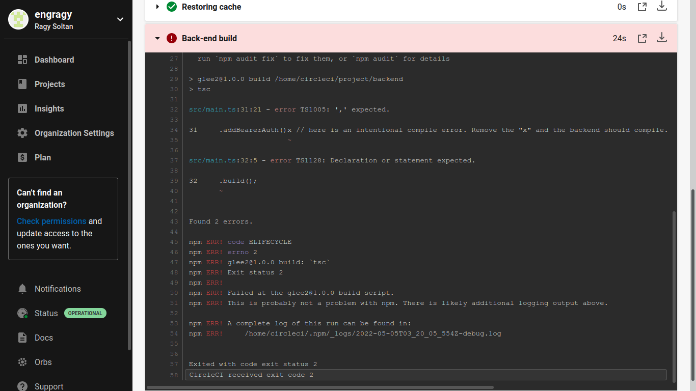
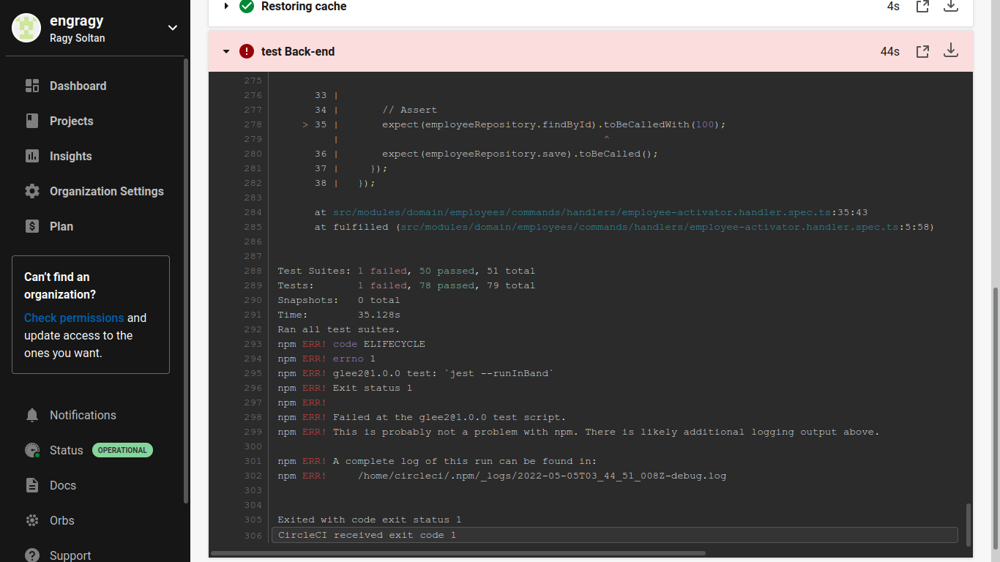
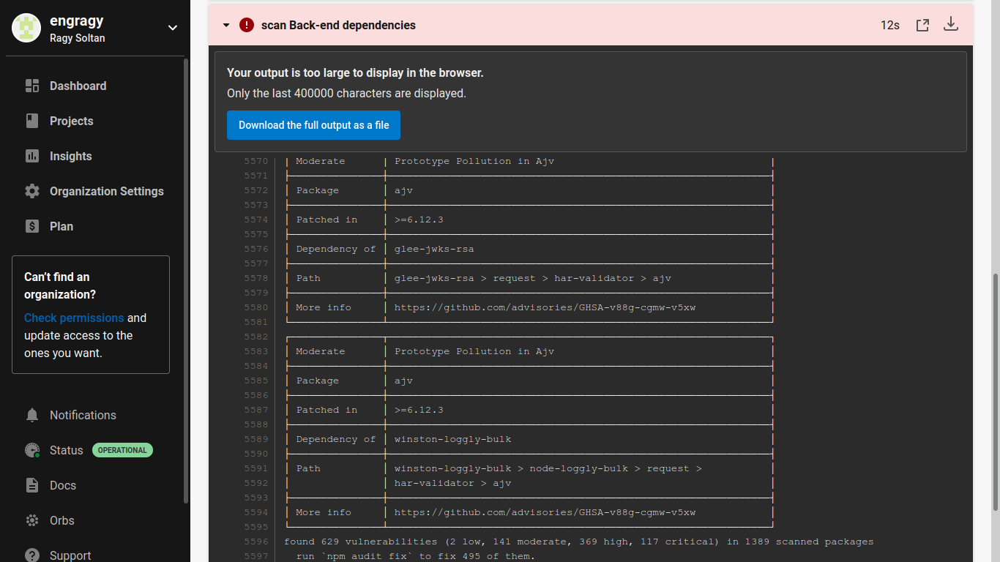
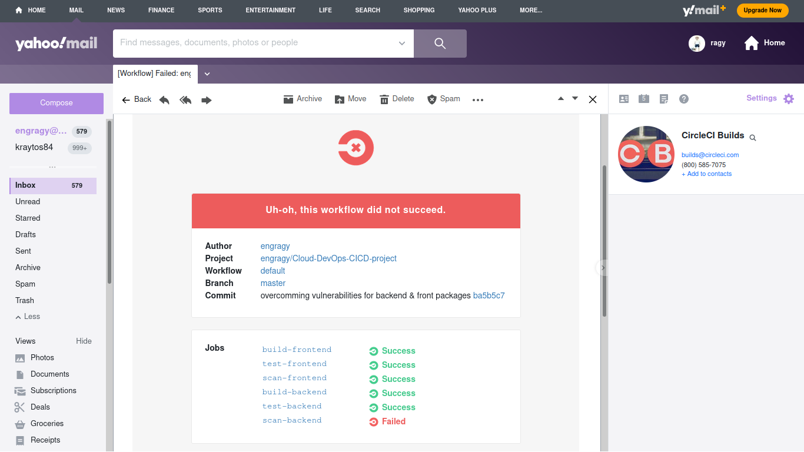

# Project Solution Screenshots
[URL01 - public GitHub repository for udapeople project](https://github.com/engragy/Cloud-DevOps-CICD-project/tree/master/)

[URL02 - public URL for your S3 Bucket (aka, your front-end)]()

***
#### 1. Utilize Deployment Strategies to design and build CI/CD pipelines that support Continuous Delivery processes.

- Console output of various pre-deploy job failure scenarios:
	- Build Jobs that failed because of compile errors. 

	- Failed unit tests. 

	- Failure because of vulnerable packages. 
	
	- An alert from one of your failed builds.
		- Slack notification 
		- Email notification 

***
#### 2. Utilize a Configuration Management Tool to Accomplish Deployment to Cloud-Based Servers