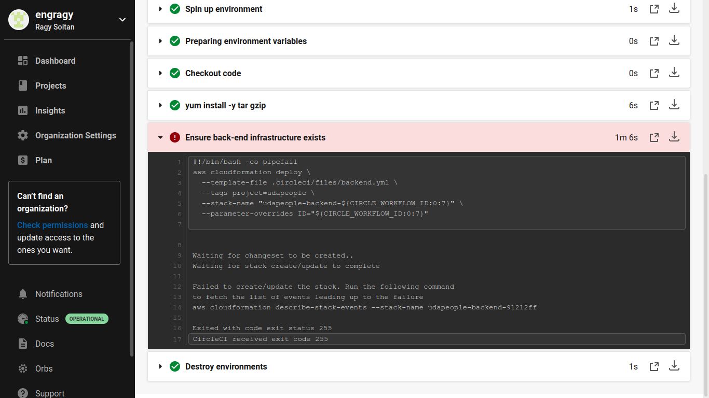
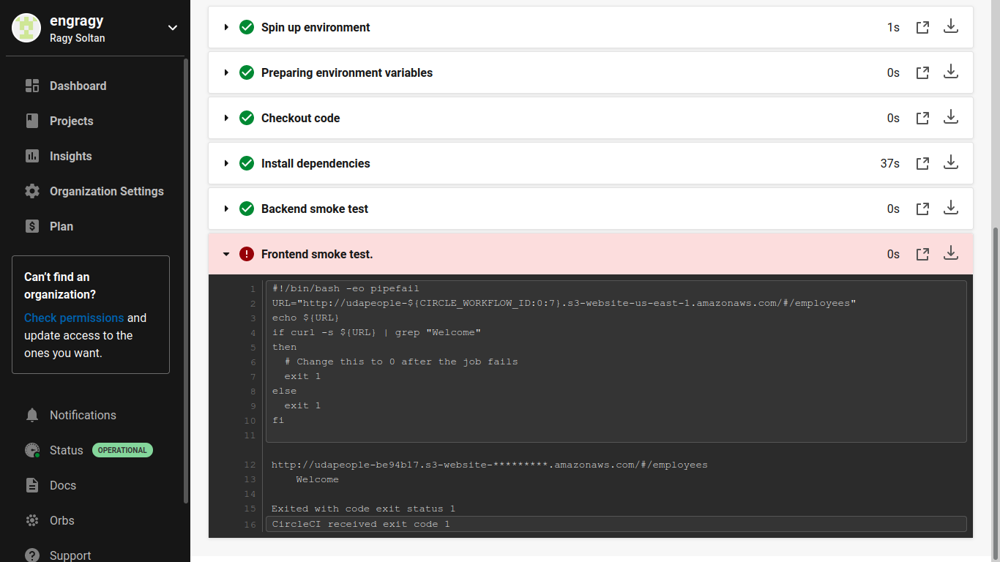
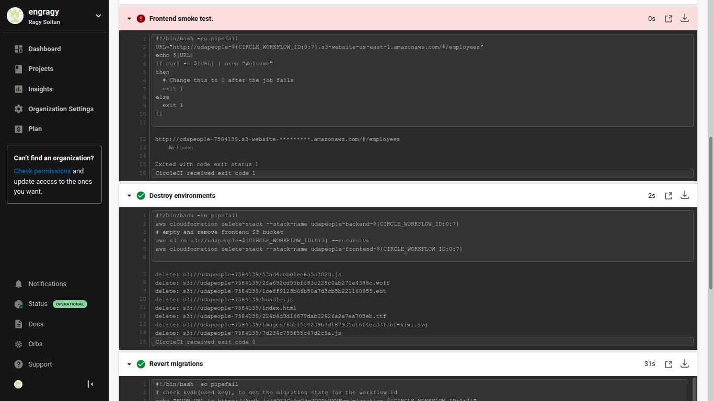
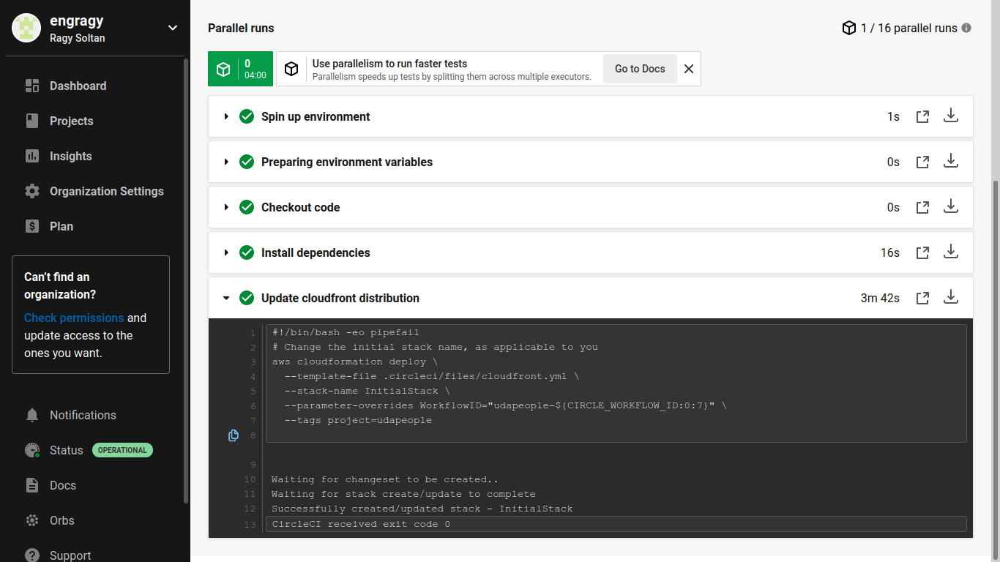

# Project Solution Screenshots
[URL01 - public GitHub repository for udapeople project](https://github.com/engragy/Cloud-DevOps-CICD-project/tree/master/)

[URL02 - public URL for your S3 Bucket (aka, your front-end)](http://udapeople-905bc5d.s3-website-us-east-1.amazonaws.com)

***
#### 1. Utilize Deployment Strategies to design and build CI/CD pipelines that support Continuous Delivery processes.

- A public git repository with your project code. [URL01](https://github.com/engragy/Cloud-DevOps-CICD-project/tree/master/)
- Console output of various pre-deploy job failure scenarios:
	- **[SCREENSHOT01]** Build Jobs that failed because of compile errors. 

	- **[SCREENSHOT02]**  Failed unit tests. 

	- **[SCREENSHOT03]** Failure because of vulnerable packages. 
	
	- **[SCREENSHOT04]** An alert from one of your failed builds.
		- Slack notification 
		- Email notification 

***
#### 2. Utilize a Configuration Management Tool to Accomplish Deployment to Cloud-Based Servers

- **[SCREENSHOT05]** Console output of appropriate failure for infrastructure creation job (using CloudFormation). 
- **[SCREENSHOT06]** Console output of a smoke test job that is failing appropriately. 
- **[SCREENSHOT07]** Console output of a successful rollback after a failed smoke test. 
- **[SCREENSHOT08]** Console output of successful promotion of new version to production in CloudFront. 

- **[SCREENSHOT09]** Console output of successful cleanup job that removes old S3 bucket and EC2 instance. ![SCREENSHOT09]

- **[SCREENSHOT010]** Evidence that deploy jobs only happen on master branch. ![SCREENSHOT10]

- **[SCREENSHOT08]** Evidence of deployed and functioning front-end application in an S3 bucket [URL02] and in CloudFront. [URL03]

- Evidence of healthy back-end application. [URL04]